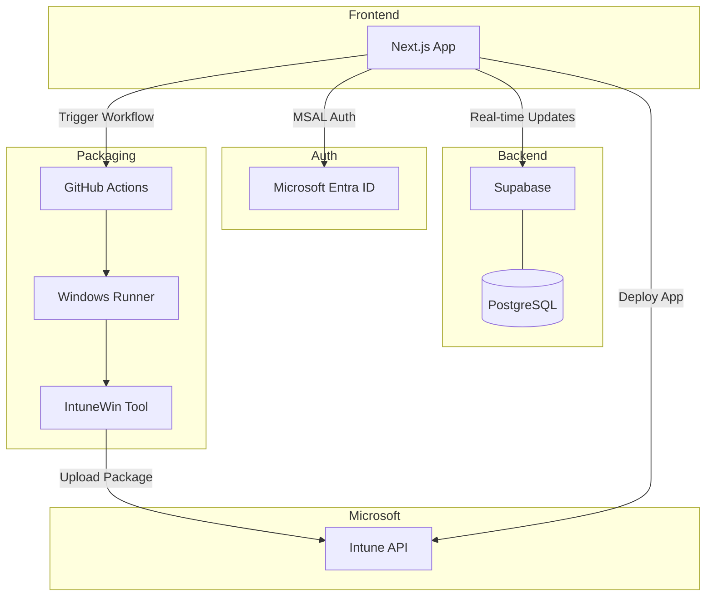

<div align="center">


# IntuneGet

**Deploy Winget applications to Microsoft Intune with a single click.**

[](https://github.com/ugurkocde/IntuneGet/actions)
[](LICENSE)
[](https://github.com/ugurkocde/IntuneGet/releases)
[](https://github.com/ugurkocde/IntuneGet/stargazers)
[](https://nextjs.org/)
[](https://www.typescriptlang.org/)

[Get Started](https://intuneget.com) | [Documentation](docs/SELF_HOSTING.md) | [Contributing](CONTRIBUTING.md)

</div>

---

## Why IntuneGet?

Deploying applications to Microsoft Intune shouldn't require hours of manual packaging and configuration. IntuneGet transforms a tedious multi-step process into a single click.

| Traditional Workflow | With IntuneGet |
|---------------------|----------------|
| Search for installer downloads | Browse curated catalog |
| Download and verify installers | One-click selection |
| Install IntuneWin tool locally | Automated cloud packaging |
| Create .intunewin packages manually | Instant .intunewin generation |
| Upload to Intune portal | Direct deployment to tenant |
| Configure detection rules | Pre-configured settings |
| Repeat for each application | Deploy multiple apps in minutes |

---

## Features

### For IT Admins

- **Curated App Catalog** - Browse 100+ pre-configured applications ready for Intune deployment
- **One-Click Deployment** - Deploy apps directly to your Microsoft Intune tenant
- **Real-Time Status** - Track deployment progress with live updates
- **Pre-Configured Detection Rules** - Skip the manual configuration

### For Managed Service Providers

- **Multi-Tenant Support** - Works with any Microsoft Entra ID tenant
- **MSP Mode** - Manage multiple client tenants from a single interface
- **Audit Trail** - Track all deployments across your client base
- **Tenant Isolation** - Each client's data remains completely separate

### For Self-Hosters

- **Multiple Database Options** - Supabase Cloud, self-hosted Supabase, or SQLite
- **Flexible Packaging** - GitHub Actions or local Windows packager
- **Air-Gapped Support** - Run entirely on-premises with no external dependencies
- **Full Source Access** - Audit, modify, and extend as needed

---

## Quick Start

### Hosted Version (Recommended)

The fastest way to get started:

<div align="center">

[](https://intuneget.com)

</div>

### Self-Host with Docker

```bash
git clone https://github.com/ugurkocde/IntuneGet.git
cd IntuneGet
cp .env.example .env.local
# Edit .env.local with your configuration
docker-compose up -d
```

### Deploy to Vercel

[](https://vercel.com/new/clone?repository-url=https://github.com/ugurkocde/IntuneGet)

See the [Self-Hosting Guide](docs/SELF_HOSTING.md) for detailed instructions.

---

## Architecture



| Component | Technology | Purpose |
|-----------|------------|---------|
| Frontend | Next.js 14, React, TypeScript | Web application and UI |
| Database | Supabase (PostgreSQL) | App catalog, deployment status, real-time subscriptions |
| Authentication | MSAL | Microsoft Entra ID integration (multi-tenant) |
| Packaging | GitHub Actions | Windows runner for .intunewin file generation |
| Deployment | Intune Graph API | Application deployment to tenants |

---

## Self-Hosting Options

IntuneGet is designed for flexibility. Choose the deployment model that fits your organization.

### Deployment Options

| Option | Best For | Complexity |
|--------|----------|------------|
| **Docker Compose** | Production self-hosting | Low |
| **Vercel** | Quick deployment, serverless | Low |
| **Full Self-Hosted** | Air-gapped environments, maximum control | Medium |

### Database Options

| Option | Description | Use Case |
|--------|-------------|----------|
| **Supabase Cloud** | Managed PostgreSQL with real-time | Fastest setup, hosted version |
| **Self-Hosted Supabase** | Full Supabase stack on your infrastructure | Enterprise, compliance requirements |
| **SQLite** | Single-file database | Development, small deployments |

### Packaging Options

| Option | Description | Use Case |
|--------|-------------|----------|
| **GitHub Actions** | Cloud-based Windows runner | Default, no infrastructure needed |
| **Local Packager** | npm package for on-premises | Air-gapped, compliance requirements |

See [Database Setup](docs/DATABASE_SETUP.md) and [GitHub Actions Setup](docs/GITHUB_ACTIONS_SETUP.md) for configuration details.

---

## Security

IntuneGet is built with security as a core principle.

### Multi-Repository Design

- **Source Code** (this repo) - Fully open source, transparent, and auditable
- **Workflow Execution** - Runs in a private repository to protect tenant information
- **Tenant Isolation** - Tenant IDs are masked in logs and never visible in public workflow runs

### Data Handling

- **No Data Storage** - IntuneGet does not store your application binaries or tenant credentials
- **HMAC-SHA256 Verification** - All callbacks are cryptographically signed
- **Token Handling** - Access tokens are never persisted and expire after use

### Air-Gapped Support

For organizations with strict compliance requirements:
- Run the local packager on your own Windows infrastructure
- Use self-hosted Supabase or SQLite
- No external network calls required

See [SECURITY.md](SECURITY.md) for our complete security policy.

---

## Tech Stack

| Category | Technology |
|----------|------------|
| **Frontend** | [Next.js 14](https://nextjs.org/) with App Router |
| **Language** | [TypeScript](https://www.typescriptlang.org/) |
| **UI Components** | [shadcn/ui](https://ui.shadcn.com/) |
| **Styling** | [Tailwind CSS](https://tailwindcss.com/) |
| **Database** | [Supabase](https://supabase.com/) (PostgreSQL) |
| **Authentication** | [MSAL](https://github.com/AzureAD/microsoft-authentication-library-for-js) (Microsoft Entra ID) |
| **State Management** | [Zustand](https://zustand-demo.pmnd.rs/) + [TanStack Query](https://tanstack.com/query) |
| **Animations** | [Framer Motion](https://www.framer.com/motion/) |
| **Deployment** | [Vercel](https://vercel.com/), Docker |

---

## Documentation

| Document | Description |
|----------|-------------|
| [Self-Hosting Guide](docs/SELF_HOSTING.md) | Complete guide for self-hosting IntuneGet |
| [Azure AD Setup](docs/AZURE_AD_SETUP.md) | Configure Microsoft Entra ID app registration |
| [GitHub Actions Setup](docs/GITHUB_ACTIONS_SETUP.md) | Set up the packaging pipeline |
| [Database Setup](docs/DATABASE_SETUP.md) | Supabase configuration options |
| [Development Guide](docs/DEVELOPMENT.md) | Local development setup |

---

## Contributing

Contributions are welcome. Please read [CONTRIBUTING.md](CONTRIBUTING.md) before submitting a pull request.

## License

This project is licensed under the [GNU Affero General Public License v3.0 (AGPL-3.0)](LICENSE).

- Self-host for internal business use
- Modify for personal or internal use
- Network service modifications must be open-sourced

---

<div align="center">

**Simplify your Intune deployments.**

[Get Started](https://intuneget.com) | [Documentation](docs/SELF_HOSTING.md) | [Report an Issue](https://github.com/ugurkocde/IntuneGet/issues)

</div>
